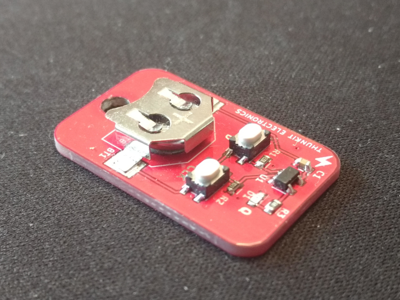

# About #

Thunkit Electronics sells electronic kits for hobbyists and engineers alike. Available at [thunkitelectronics.com](https://thunkitelectronics.com/category.html?page=development) and [Tindie](https://www.tindie.com/stores/cmccaskey). All designs are open source with schematics, board layouts, code, and BOMs freely available.

## In This Repository ##
| POGO ICSP | BREADBOARD ICSP | LOGIC-KEYCHAIN | MAKIT-THT |
| ------------------------------------------ | ----------------------------------------- | ----------------------------------------- |
|  |  |  |  |
| Spring loaded pogo pins for AVR ICSP programming | Breakout for AVR ICSP Cable | D flip-flop SMD soldering keychain kit | DIY 100% Through-hole Arduino kit |
