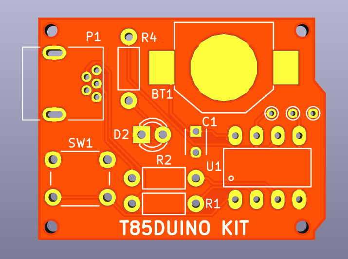

# About #

Thunkit Electronics sells electronic kits for hobbyists and engineers alike. Available at [thunkitelectronics.com](https://thunkitelectronics.com) and [Tindie](https://www.tindie.com/stores/cmccaskey). All designs are open source with schematics, board layouts, code, and BOMs freely available.

## Description ###
  
The T85DUINO is a mini Arduino board featuring the ATTiny85. The T85DUINO is a 3V board powered by a CR1025 battery making this a great choice to show off your soldering and programming skills if you choose to wear it as a badge.

## Why T85DUINO? ##
The T85DUINO is a mini Arduino kit. This makes the T85DUINO a simple yet fun soldering kit that has the added value of being a development board for the ATtiny85 after assembly. The T85DUINO can be used as a development board, directly in your project, or even a badge to show off your soldering and programming skills.

## Technical Specifications ##

The T85DUINO uses the ATtiny85 as the main microconroller. The ATtiny85 is flashed with Gemma boot by Adafruit that allows the T85DUINO to be reprogrammed in the Arduino IDE. 

The T85DUINO runs directly off of 3V from a CR1025 battery. While this is enough to blink the on-board LED, it is posible to brown out the microcontroller if the external connections on the board are used without consideration to this fact.

Since the T85DUINO runs at 3V, the board only requires the 68 Ohm termination resistors for USB and doesn't require the zener diodes to limit the USB data line voltages.

The T85DUINO has an on-board LED that can be blinked to emulate the famous Blink Arduino Sketch.

## Schematic ##
PDF coming soon...Please check KiCad files

## Bill of Material ##
PDF coming soon...Please check KiCad files

## Soldering Instructions ##
Coming soon...
