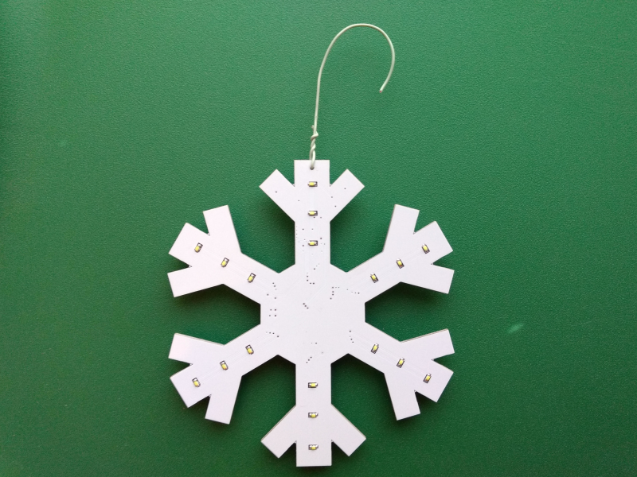
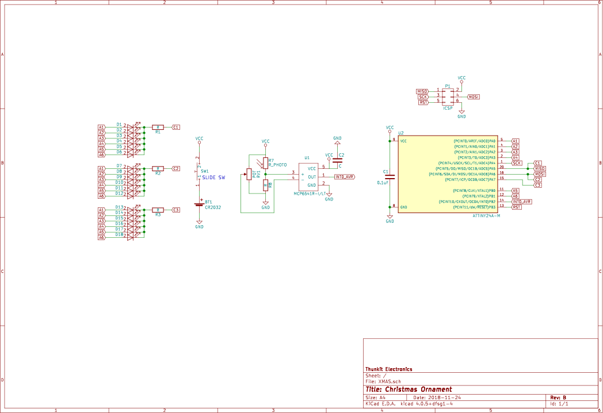

# About #

Thunkit Electronics sells electronic kits for hobbyists and engineers alike. Available at [thunkitelectronics.com](https://thunkitelectronics.com) and [Tindie](https://www.tindie.com/stores/cmccaskey). All designs are open source with schematics, board layouts, code, and BOMs freely available.

## Description ###
  
The Thunkit Electronics Christmas Ornament is a trendy PCB christmas ornament that lights up 18 cool while LEDs in a spiral pattern. This is light sensitive and only triggers in the dark in 30 second intervals. Powered by a CR2032 battery, battery life is approximately 4 months due to the heavy use of interrupts for timing.

Note: Board shown is REV A, REV B has small tweaks to the layout and the removal of the bodge wire near the microcontroller.

## Schematic ##

